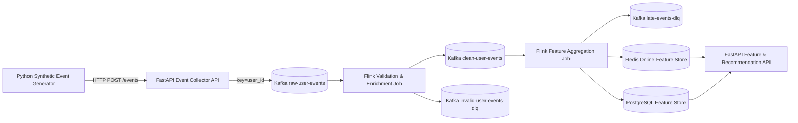

# realtime-recommendation-feature-store

이커머스 사용자 행동 이벤트를 실시간으로 수집하고, Kafka와 Flink로 추천 피처를 계산한 뒤 Redis 온라인 피처 스토어와 PostgreSQL 피처 이력 저장소에 저장하는 **실시간 추천 피처 스토어 MVP**입니다.

이 프로젝트는 데이터엔지니어 포트폴리오용으로, 단순 API/CRUD가 아니라 **event-time streaming, watermark, stateful dedup, DLQ, sliding window aggregation, online/offline feature store 분리**를 직접 구현하는 데 초점을 둡니다.

## 핵심 요약

| 항목 | 내용 |
| --- | --- |
| 문제 | 추천 API가 사용할 사용자/상품/카테고리 실시간 피처를 안정적으로 계산하고 조회 |
| 수집 | FastAPI Event Collector가 HTTP 이벤트 수신 후 Kafka publish |
| 처리 | Java Flink DataStream API 기반 validation, dedup, event-time window aggregation |
| 저장 | Redis online feature store, PostgreSQL latest/history store |
| 제공 | FastAPI feature query, popular ranking, rule-based recommendation API |
| 실행 | Docker Compose 기반 Kafka, Redis, PostgreSQL, Flink 로컬 MVP |

## 아키텍처



## 구현 포인트

- Generator는 Kafka에 직접 쓰지 않고 실제 클라이언트처럼 FastAPI에 HTTP 요청을 보낸다.
- API는 `ingest_time`을 서버 수신 시점으로 부여하고 Kafka delivery 결과 확인 후 응답한다.
- Kafka topic은 raw, clean, invalid DLQ, late DLQ, feature update 계층으로 분리한다.
- Flink Validation Job은 JSON parsing, schema validation, 품질 검증, DLQ routing을 담당한다.
- Flink Aggregation Job은 `event_id` dedup state TTL, event-time watermark, 10분/1시간 sliding window를 사용한다.
- Redis는 최신 온라인 피처와 인기 랭킹을 제공한다.
- PostgreSQL은 latest snapshot과 window history를 저장한다.
- Recommendation API는 ML 모델 없이 최근 클릭 카테고리와 인기 상품을 섞는 rule-based 방식이다.
- Outbox Pattern은 사용하지 않으며, 그 한계와 장애 지점을 문서화했다.

## 기술 스택

| 영역 | 기술 |
| --- | --- |
| API | Python 3.11+, FastAPI, Pydantic, SQLAlchemy async, Redis client, confluent-kafka |
| Stream Processing | Java 17, Apache Flink DataStream API |
| Messaging | Apache Kafka |
| Storage | Redis, PostgreSQL |
| Infra | Docker Compose |
| Test | pytest, JUnit 5, Gradle |

## 빠른 실행

인프라 기동과 Kafka 토픽 생성:

```bash
scripts/run-local.sh
```

API 실행:

```bash
cd api
python3 -m pip install -e ".[dev]"
../scripts/run-api.sh
```

Flink Job 빌드:

```bash
docker run --rm -v "$PWD/flink-jobs:/workspace" -w /workspace gradle:8.8-jdk17 gradle shadowJar --no-daemon
```

Flink Job 제출:

```bash
scripts/submit-flink-jobs.sh
```

이벤트 생성:

```bash
scripts/run-generator.sh --mode scenario --user-id u_10001 --category-id c_electronics --rate 20 --duration 120
```

API 조회:

```bash
curl "http://localhost:8000/features/users/u_10001"
curl "http://localhost:8000/popular-products?window=10m&limit=20"
curl "http://localhost:8000/recommendations/users/u_10001?limit=20"
```

## 데모 확인 포인트

Redis 온라인 피처:

```bash
docker compose exec -T redis redis-cli hgetall feature:user:u_10001
docker compose exec -T redis redis-cli zrevrange rank:product:popular:10m 0 20 withscores
```

PostgreSQL 피처 이력:

```bash
docker compose exec -T postgres psql -U feature_store -d feature_store -c "SELECT count(*) FROM feature_product_history;"
docker compose exec -T postgres psql -U feature_store -d feature_store -c "SELECT count(*) FROM feature_user_history;"
```

Flink Job 상태:

```bash
curl -fsS http://localhost:18081/overview
```

## 주요 API

```text
GET  /health
GET  /metrics
POST /events
POST /events/bulk
GET  /features/users/{user_id}
GET  /features/products/{product_id}
GET  /features/categories/{category_id}
GET  /popular-products?window=10m&limit=20
GET  /popular-categories?window=10m&limit=20
GET  /recommendations/users/{user_id}?limit=20
```

추천 API 응답 예시:

```json
{
  "user_id": "u_10001",
  "items": [
    {
      "product_id": "p_00042",
      "score": "1000120.0",
      "reason": "recent_click_category_popular"
    }
  ]
}
```

## MVP 범위와 의도적 한계

- 10분 sliding window, 1분 slide
- 1시간 sliding window, 5분 slide
- 24시간 window는 확장 가능하도록 설계하되 MVP에서는 우선순위를 낮춘다.
- 복잡한 Prometheus/Grafana는 제외하고 `/metrics` 엔드포인트로 기본 지표를 제공한다.
- ML 모델은 사용하지 않고 rule-based recommendation을 구현한다.
- 완전한 end-to-end exactly-once를 단정하지 않는다.
- Outbox Pattern은 사용하지 않는다.

## 중요한 설계 결정

- Event Collector API가 Kafka producer를 소유한다.
- FastAPI는 Kafka publish 성공을 확인한 뒤 성공 응답을 반환한다.
- Flink Job은 Java 17과 Apache Flink Java DataStream API로만 구현한다.
- MVP 기본 Flink State Backend는 `HashMapStateBackend`이다.
- checkpoint interval 기본값은 60초이다.
- 로컬 checkpoint path는 `/tmp/flink-checkpoints`이다.
- 로컬 savepoint path는 `/tmp/flink-savepoints`이다.
- 대용량 상태 또는 운영 환경에서는 `EmbeddedRocksDBStateBackend`로 전환할 수 있도록 설정을 분리한다.

## 문서

- [Architecture](docs/architecture.md)
- [Event Schema](docs/event_schema.md)
- [Feature Definitions](docs/feature_definitions.md)
- [Processing Policy](docs/processing_policy.md)
- [Operational Tradeoffs](docs/operational_tradeoffs.md)
- [API Contract](docs/api_contract.md)
- [Step Plan](docs/step_plan.md)
- [Testing](docs/testing.md)
- [Demo Scenario](docs/demo_scenario.md)
- [E2E Smoke Test Result](docs/e2e_smoke_test.md)
- [Troubleshooting](docs/troubleshooting.md)

## 테스트

Python 테스트:

```bash
cd api
python3 -m pytest -q

cd ../event-generator
python3 -m pytest -q
```

Flink Java 테스트:

```bash
docker run --rm -v "$PWD/flink-jobs:/workspace" -w /workspace gradle:8.8-jdk17 gradle test --no-daemon
```

전체 테스트와 smoke test 절차는 [Testing](docs/testing.md)을 따른다.

## 처리 보장과 한계

이 프로젝트는 완전한 end-to-end exactly-once를 단정하지 않는다. 정확한 표현은
**Flink 내부 상태 복구는 checkpoint로 보호하지만, Kafka/Redis/PostgreSQL까지 포함한
외부 sink 전체의 원자적 exactly-once commit은 보장하지 않는 MVP**이다.

보장 범위:

- FastAPI는 Kafka delivery 결과를 확인한 뒤 성공 응답을 반환한다.
- FastAPI Kafka producer는 idempotence와 `acks=all`을 사용해 producer retry 중복을 완화한다.
- Flink는 checkpoint를 활성화해 window state와 dedup state를 장애 시 복구한다.
- Flink의 Kafka feature update sink는 `AT_LEAST_ONCE`로 동작한다.
- Redis sink와 PostgreSQL sink는 Flink checkpoint transaction과 묶인 two-phase commit sink가 아니다.
- Redis 최신 피처는 같은 feature key overwrite로 중복 write 영향을 줄인다.
- PostgreSQL latest는 upsert, history는 window unique constraint로 중복 insert를 제한한다.

적용한 중복 방지 장치:

- FastAPI Kafka producer idempotence
- Kafka `acks=all`
- Flink checkpoint
- Flink `event_id` dedup state TTL
- Redis feature key 기준 overwrite
- PostgreSQL latest upsert
- PostgreSQL history unique constraint

따라서 장애 복구 시 일부 외부 sink write는 재시도될 수 있다. 이 프로젝트는 그 영향을
sink idempotency와 unique constraint로 완화하는 구조이며, 운영 환경에서 강한
end-to-end exactly-once가 필요하면 Kafka transactional sink, Flink two-phase commit
sink, Outbox/Inbox, DLQ replay 절차를 추가로 설계한다.

Outbox Pattern을 사용하지 않기 때문에 API 수신과 Kafka publish를 하나의 DB transaction으로 묶지 않는다. API는 Kafka delivery 결과를 확인한 뒤 성공 응답을 반환하지만, API 프로세스 장애나 네트워크 장애 구간에서 운영 재처리 자동화는 제한적이다. 이 한계는 MVP 단순성과 포트폴리오 설명 가능성을 위한 선택이다.

## Flink State Backend 정책

MVP 기본 State Backend는 `HashMapStateBackend`이다.

- checkpoint interval: `60s`
- checkpoint path: `/tmp/flink-checkpoints`
- savepoint path: `/tmp/flink-savepoints`
- dedup state TTL: 기본 `25h`

HashMapStateBackend는 로컬 Docker Compose MVP에서 설정이 단순하고, 제한된 이벤트 볼륨의 데모에 적합하다. 운영 환경, 높은 key cardinality, 큰 dedup/window state, 장시간 window, 대규모 checkpoint 안정성이 필요해지면 `EmbeddedRocksDBStateBackend`로 전환한다.
